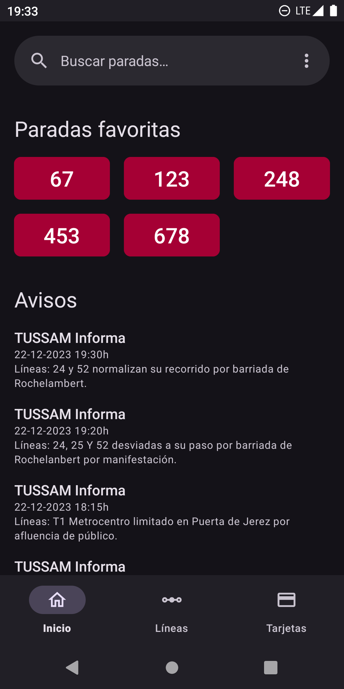
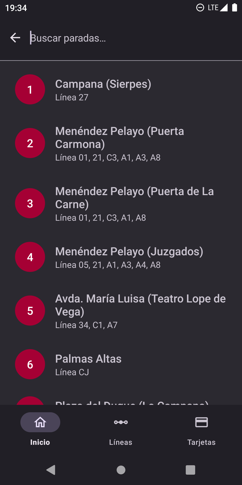
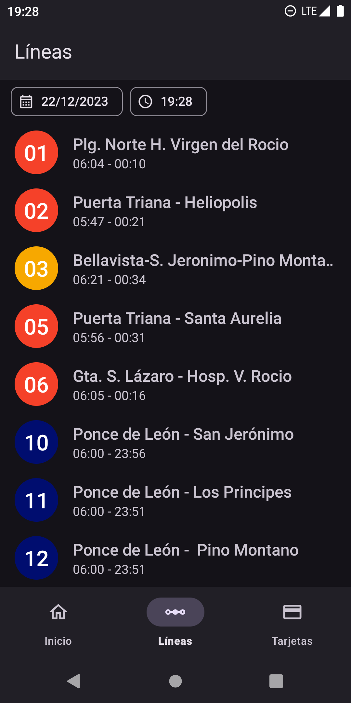
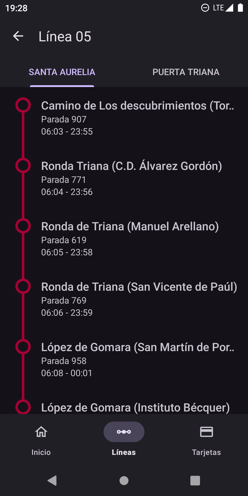
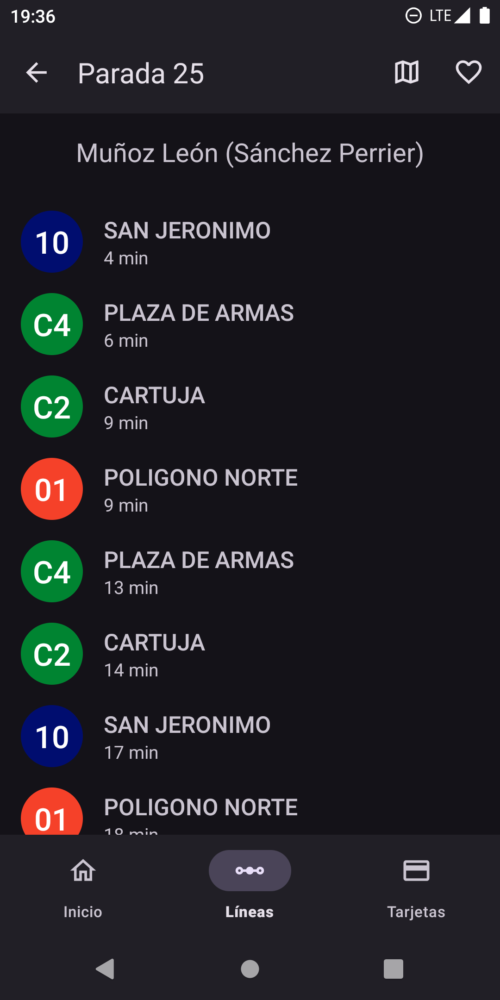
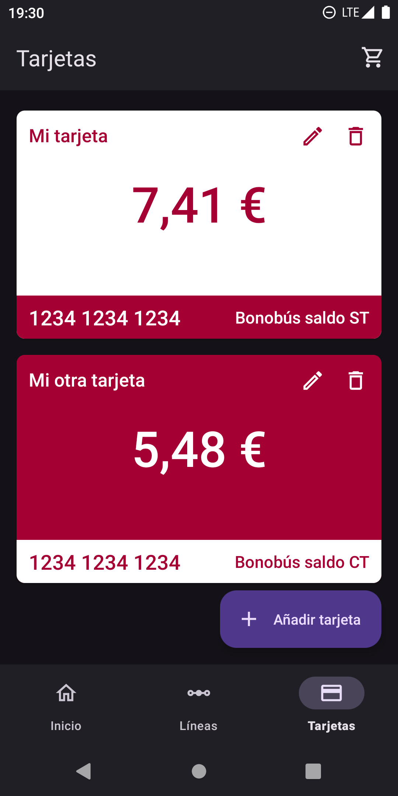

    
    <h1>TussApp</h1>
    <h5>🚍 A modern, open-source Android app for real-time public transport information in Seville, Spain 🚍</h5>
    
    
    

## Description

With **TussApp** you can view information about bus stops, lines and real-time estimations for the next bus arrival. You can also save your cards and view the balance and other information everytime you want. The data is retrieved from the official API used in AppTUSSAM, which was reverse-engineered to re-implement it here.

*Disclaimer: TussApp is not affiliated in any way with TUSSAM.*

## Download

## Screenshots

## Features

- View information about all bus lines available for a certain date and time, and all stops for each direction
- Search for bus stops by number or name, and see the lines that pass through that stop
- View real-time estimations for the next bus arrival, with convenient buttons to open in the map or add to favorites
- View all the information about your travel cards, like the number, type and available balance
- View current announcements and notices straight from TUSSAM
- Save the stops you want in favorites for easy access

## Technical details

- 100% Kotlin, with Coroutines, Flow, and more!
- Modern MVVM architecture
- Material 3 & Material You dynamic theming
- Beautiful Material transitions
- Navigation Component
- Multi-module project following the Clean Architecture principles
- Retrofit for API requests, Room for data persistence
- Dependency injection with Hilt
- Testing with JUnit and MockK

## Upcoming features and to-dos

- Upload to F-Droid
- Maybe upload to Google Play
- Information icons in bus stops
- Map of bus lines
- Last trips of card and more info
- Card warnings in home screen (low balance, etc.)
- Shortcuts for favorite stops
- Migrate to Jetpack Compose
- Try Compose Multiplatform
- ... and more!

## Contributing

PRs are welcome. If you have any bug report or suggestion, feel free to open an issue.